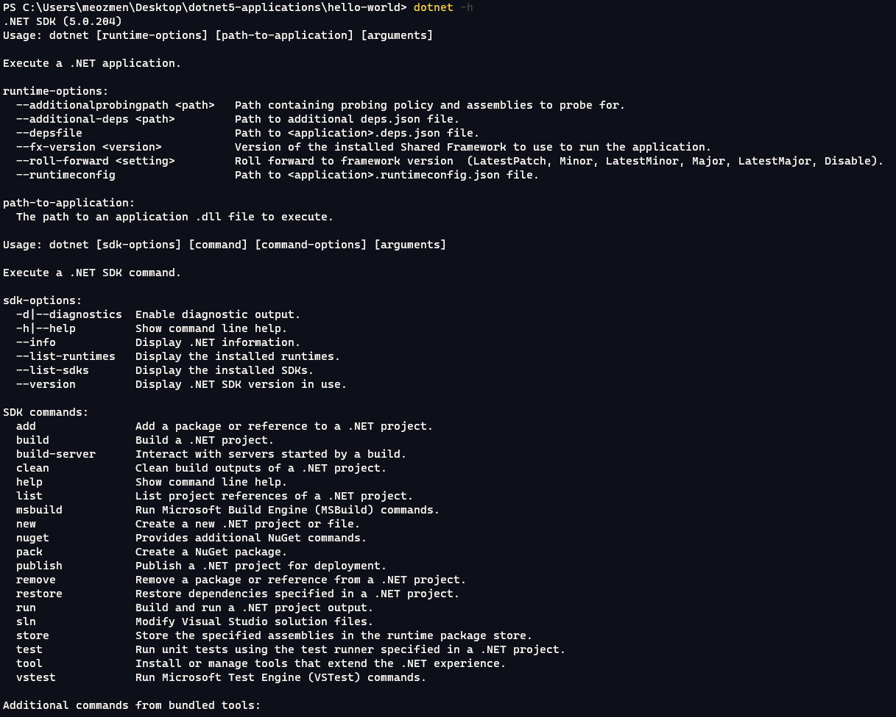

# Chapter 01 - Create Hello World Solution and Web Application

###### ***Note Before I start**: I will do all my work with Windows Terminal and Visual Studio Code for the command line using practice. If you're not familiar with that, you will use other ways.*

## 1.1 Solution & Project Creating Operations

Hello everyone! In this chapter

- We will be using Dotnet CLI for creating any solution or project.
- We will add project files to the solution
- We will review and debug the project files
- We will understand how the Kestrel server stands up, and change project configurations.

If you are using the CLI for the first time and you don't have an idea about its commands; you can get support for every command with "-h"

First of all, I entered the "dotnet new" command and I encountered the following output. Because I wasn't meeting the argument expectation for a new command. In this case, the returned output contains dotnet project templates. 

I will create "sln" and "web" short names. For creating a solution file, I changed the directory ./src/HelloWorld and type "dotnet new sln". When I typed that, dotnet created a solution file in my folder. 

I will work on a "web" short-named project and I need to create that project type. For that, I changed the directory again "./HelloWorld.WebApp" and type "dotnet new web". (For other short names you will check the second image)

When I typed that, HelloWorld.WebApp folder filled with project files. But, I didn't attach my project to the solution file. How can I add that project? 

If I don't know, I will be type "dotnet sln -h" for that.

"dotnet sln" has the "add" command and takes project parameters for attachment. For that, I changed the directory again and typed "dotnet sln add './HelloWorld.WebApp'" and hurray! My HelloWorld.WebApp was added to the solution.

I will use Visual Studio Code and the following extension named "vscode-solution-explorer" to open my solution file. 

At that point, you will use the "code ." command at the .sln file directory. 

If you're installed that extension, the sidebar contains the "Solution" icon. You will use that section for managing your solution.

## 1.2 Project Details

We have created a "web" project in the previous title. Web projects are not like MVC, Razor, or Blazor templates. This is the core project structure for the Kestrel web server running. This project includes Startup.cs, Program.cs, appsettings.json, and launchSettings.json files. 

Let's look at these.

If we're looking Program.cs, we're seeing static Main method and static CreateHostBuilder methods. Main is the first flow of the program.

The host is the static class under Microsoft.Extensions.Hosting namespace. 

This class has 2 types of CreateDefaultBuilder: with args and without args. Under the Program.cs, default template using with args type and this method's return type is IHostBuilder. (This event is called "method chaining" or "fluent interface"). 

Another IHostBuilder interface method ConfigureWebHostDefaults takes action for web host building configuration. If you're looking at the webBuilder object, we have so many configurations for hosting your web application. But this boilerplate includes only UseStartup for bind Startup class for web hosting.

If we're going to Startup.cs, we're seeing two methods: ConfigureServices and Configure.

ConfigureServices is the default .NET DI solution runtime method. I'm skipping it for now, we'll take a look later.

If we focus Configure method, we will see two parameters: "IApplicationBuilder app" and "IWebHostEnvironment env" objects. 

IWebHostEnvironment env object includes some Environment settings and their check methods (IsDevelopment, IsProduction, etc.)

IApplicationBuilder app object used to configure an application's request pipeline. Also named as middleware management. What is the middleware?

Middlewares are structures between requests and responses. Their orders matter because work sequentially. We are set that with the IApplicationBuilder app object. If we return the Startup.cs, we're seeing routing and endpoint middlewares. Let's toggle breakpoint, debug and see what happens at Startup.cs. 

Did you use VSCode like me and don't configure debugging yet? Come with me next section.

## 1.3 Visual Studio Code Debugging Configuration

In this section, I will configure VSCode for debugging C# application. For that, we must add a configuration file named "launch.json".

For creating that file, you will open the "Run" menu, choose the "Add Configuration" and after select ".NET Core". This will be created that automatically.

This file includes debug args, cwd, environment setup and other maps for debugging. (You will search for details about launch.json settings.)

For now, that default configuration is enough for my debug.

## 1.4 Back To The Project

After configuring launch.json, I toggle breakpoint at line 24 at Startup.cs. I selected the "Run" menu and click "Start Debugging" (or the short way, F5 keypress). That's all! debugging started.

If you're familiar with Visual Studio debug screen, Code is different but not harder at all.

At the Run & Debug Screen, we will track variables and call stack. If you expand "env" variable, you can see ApplicationName, EnvironmentName and other properties. 

But wait, how can EnvironmentName property filled as "Development"? Did you remember launch.json?

I've changed that variable and debug the project. Did you see it? Env variable is changed.

All right, we have changed EnvironmentName properties. For now, I will need to pass my name to the project and use that. How can I do that? In the same way? Nope, I have to do it a little different way.

In the project, we have an "appsettings.json" file. This file includes static setting declarations about my project. For example, I define my name in this file with the "Name" variable.

For reading that key, I went back to Startup.cs and make some changes.

I created a constructor for the Startup class and pass the IConfiguration configuration parameter. And, at the configure method, I take that as a "name" variable. 

Let's debug again and see my name at the variable. 

Yay! That worked! 

But, how configuration interface is filled with appsettings.json?

If you remember Program.cs's Main method, CreateHostBuilder method prepare with "Host.CreateDefaultBuilder(args)". That default builder doing the following: 

> - ChainedConfigurationProvider : Adds an existing IConfiguration as a source. In the default configuration case, adds the host configuration and set it as the first source for the app configuration.
> - appsettings.json using the JSON configuration provider.
> - appsettings.Environment.json using the JSON configuration provider. For example, 
> - appsettings.Production.json and appsettings.Development.json. 
> - App secrets when the app runs in the Development environment.
> - Environment variables using the Environment Variables configuration provider.
> - Command-line arguments using the Command-line configuration provider. 
> 
> (Thanks for Ogglas's answer about that reading https://stackoverflow.com/questions/31453495/how-to-read-appsettings-values-from-a-json-file-in-asp-net-core)

### What Did We Do In This Chapter?

- We created solution and project files
- Added project file to the solution
- Open Solution with the help of the plugin at the VSCode
- We saw the work order and how the web server's configuration is set up
- Create launch.json file for debugging .NET application
- We changed the EnvironmentName properties
- Watched variable from the "Run and Debug" tab.
- Reading a key value from appsettings.json

### Exersize

Create a new endpoint with any name, read your name from appsettings.json, and return a response that is JSON.

